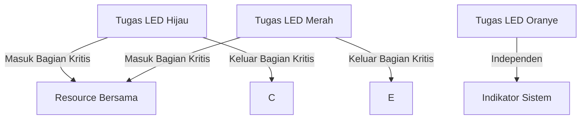

# Demonstrasi Pengaruh Sharing Resource dalam Multitasking

## Gambaran Proyek

Proyek ini menunjukkan bagaimana berbagi resource dalam desain multitasking dapat memengaruhi performa sistem. Dengan menjalankan beberapa tugas yang saling berbagi resource, kita dapat mengamati degradasi performa sistem, yang diwujudkan melalui perubahan pola nyala/mati LED.

## Deskripsi Proyek

Tugas-tugas dalam proyek ini dirancang untuk menyalakan dan mematikan LED dengan waktu tunda tertentu. Ketika mereka mencoba mengakses resource bersama tanpa mekanisme kontrol, degradasi performa akan terjadi, terlihat dari LED yang tidak berfungsi sebagaimana mestinya. Solusi yang diimplementasikan adalah dengan menggunakan mekanisme eksklusi mutual melalui penonaktifan interupsi (`taskENTER_CRITICAL` dan `taskEXIT_CRITICAL`).

## Tugas

### 1. **Tugas LED Hijau**
   - **Deskripsi**: Menghidupkan dan mematikan LED hijau.
   - **Prioritas**: Normal.
   - **Langkah**:
     - Hidupkan LED hijau.
     - Masuk ke bagian kritis (`taskENTER_CRITICAL`).
     - Akses resource bersama.
     - Keluar dari bagian kritis (`taskEXIT_CRITICAL`).
     - Matikan LED hijau.
     - Tunggu 200ms.

### 2. **Tugas LED Merah**
   - **Deskripsi**: Menghidupkan dan mematikan LED merah.
   - **Prioritas**: Normal.
   - **Langkah**:
     - Hidupkan LED merah.
     - Masuk ke bagian kritis (`taskENTER_CRITICAL`).
     - Akses resource bersama.
     - Keluar dari bagian kritis (`taskEXIT_CRITICAL`).
     - Matikan LED merah.
     - Tunggu 550ms.

### 3. **Tugas LED Oranye**
   - **Deskripsi**: Menyalakan dan mematikan LED oranye dengan kecepatan 10 Hz.
   - **Prioritas**: Di atas Normal.
   - **Langkah**:
     - Toggle LED oranye setiap 50ms.

### 4. **Resource Bersama**
   - **Akses**:
     - Periksa status flag `StartFlag`.
     - Jika `StartFlag` dalam keadaan aktif, ubah menjadi nonaktif dan lanjutkan operasi.
     - Jika tidak, nyalakan LED biru sebagai indikator kontensi.
   - **Simulasi Operasi**:
     - Simulasi akses resource dengan jeda 500ms.
   - **Reset**:
     - Matikan LED biru jika menyala.
     - Setel ulang `StartFlag` ke keadaan aktif.

## Hubungan Antar Tugas

- Tugas LED Hijau dan Merah berbagi resource yang sama, menyebabkan kontensi jika tidak ada mekanisme kontrol.
- Tugas LED Oranye tidak bergantung pada resource bersama dan berjalan secara independen.

## Diagram Alur Kerja

## Dokumentasi

## Hasil Perilaku LED

## 1. **Green LED**
   - Green LED menyala selama **200ms** saat mengakses resource bersama.
   - Setelah akses selesai, Green LED padam selama **200ms** sebelum kembali menyala.
   - Siklus ini terus berulang dengan pola yang konsisten.

## 2. **Red LED**
   - Red LED menyala selama **550ms** saat mengakses resource bersama.
   - Setelah akses selesai, Red LED padam selama **550ms** sebelum kembali menyala.
   - Siklus ini terus berulang dengan pola yang konsisten.

## 3. **Orange LED**
   -  LED oranye berkedip dengan kecepatan 10 Hz untuk menunjukkan bahwa sistem berjalan normal.

## 4. **Blue LED**
   - Blue LED menyala jika terjadi kontensi resource, yaitu ketika dua tugas mencoba mengakses resource bersama secara bersamaan.
   - Blue LED padam setelah resource selesai diakses dan `StartFlag` kembali aktif.

## Penjelasan
- Mekanisme eksklusi mutual menggunakan `taskENTER_CRITICAL` dan `taskEXIT_CRITICAL` memastikan hanya satu tugas yang dapat mengakses resource bersama pada satu waktu.
- Jika `StartFlag` dalam keadaan tidak aktif ketika salah satu tugas mencoba mengakses resource, maka Blue LED akan menyala untuk menandakan adanya kontensi.
- Simulasi akses resource memakan waktu sekitar **500ms**, yang menciptakan jeda waktu sebelum tugas lain dapat mengakses resource bersama.
